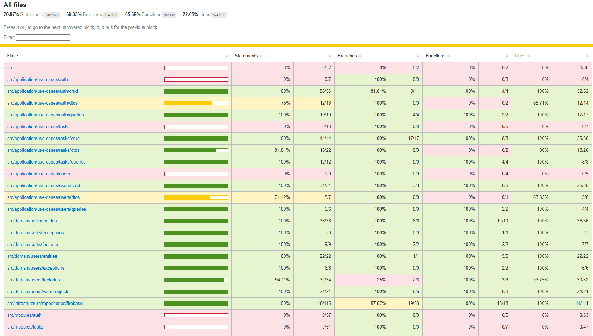
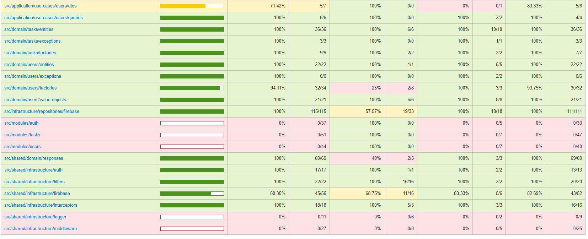

# Prueba Técnica Atom - Backend

Backend desarrollado con NestJS siguiendo principios de Clean Architecture y Domain-Driven Design (DDD).

## Arquitectura

### Clean Architecture
- **Domain Layer**: Entidades, value objects, factories y excepciones
- **Application Layer**: Casos de uso y DTOs
- **Infrastructure Layer**: Implementaciones de repositorios y servicios externos
- **Presentation Layer**: Controladores y módulos

### Domain-Driven Design (DDD)
- **Bounded Contexts**: Users, Auth, Tasks
- **Value Objects**: Email
- **Entities**: User, Task
- **Factories**: UserFactory, TaskFactory
- **Repositories**: Interfaces e implementaciones

## Tecnologías

- **Framework**: NestJS
- **Lenguaje**: TypeScript
- **Base de Datos**: Firebase Firestore
- **Autenticación**: JWT (Bearer Token + Refresh Token)
- **Documentación**: Swagger/OpenAPI
- **Testing**: Jest + Supertest
- **Package Manager**: pnpm
- **Linting**: ESLint + Prettier

## Estructura del Proyecto

```
src/
├── domain/                    # Capa de dominio
│   ├── users/                # Contexto de usuarios
│   │   ├── entities/
│   │   ├── value-objects/
│   │   ├── factories/
│   │   ├── repositories/
│   │   └── exceptions/
│   └── tasks/                # Contexto de tareas
│       ├── entities/
│       ├── factories/
│       ├── repositories/
│       └── exceptions/
├── application/              # Capa de aplicación
│   └── use-cases/
│       ├── users/
│       ├── auth/
│       └── tasks/
├── infrastructure/           # Capa de infraestructura
│   └── repositories/
│       └── firebase/
├── shared/                   # Servicios compartidos
│   └── infrastructure/
│       ├── firebase/
│       └── auth/
└── modules/                  # Módulos de presentación
    ├── users/
    ├── auth/
    └── tasks/
```

## Instalación

```bash
# Instalar dependencias
pnpm install

# Configurar variables de entorno
cp .env.example .env

# Configurar Firebase
# 1. Crear proyecto en Firebase Console
# 2. Descargar service account JSON
# 3. Configurar FIREBASE_SERVICE_ACCOUNT_PATH en .env
```

## Configuración

### Variables de Entorno

```env
# Firebase
FIREBASE_SERVICE_ACCOUNT_PATH=./firebase-service-account.json

# JWT
JWT_SECRET=your-jwt-secret
JWT_REFRESH_SECRET=your-refresh-secret
JWT_EXPIRES_IN=15m
JWT_REFRESH_EXPIRES_IN=7d

# App
PORT=3000
NODE_ENV=development
```

## Testing

```bash
# Ejecutar todas las pruebas
pnpm test

# Ejecutar pruebas en modo watch
pnpm test:watch

# Ejecutar pruebas con cobertura
pnpm test:cov
```

## API Endpoints

### Autenticación
- `POST /auth/register` - Registrar usuario
- `POST /auth/login` - Iniciar sesión
- `POST /auth/refresh` - Renovar token

### Usuarios
- `GET /users` - Obtener todos los usuarios
- `GET /users/:id` - Obtener usuario por ID
- `PUT /users/:id` - Actualizar usuario
- `DELETE /users/:id` - Eliminar usuario

### Tareas
- `POST /tasks` - Crear tarea
- `GET /tasks` - Obtener todas las tareas
- `GET /tasks/my-tasks` - Obtener tareas del usuario
- `GET /tasks/:id` - Obtener tarea por ID
- `PUT /tasks/:id` - Actualizar tarea
- `DELETE /tasks/:id` - Eliminar tarea

## Autenticación

Todos los endpoints (excepto auth) requieren autenticación JWT:

```bash
# Headers requeridos
Authorization: Bearer <jwt-token>
```

## Documentación API

Acceder a Swagger UI: `http://localhost:3000/api`

## 🚀 Despliegue

El proyecto está configurado con **despliegue automático** usando CI/CD. **No hay despliegue manual**.

### Flujo de Despliegue Automático

1. **Desarrollo**: Crear rama de feature desde `develop`
   ```bash
   git checkout develop
   git pull origin develop
   git checkout -b feature/nombre-de-tu-feature
   ```

2. **Merge a Develop**: Una vez completada la feature
   ```bash
   git checkout develop
   git merge feature/nombre-de-tu-feature
   git push origin develop
   ```

3. **Despliegue a Producción**: Merge de `develop` a `master`
   ```bash
   git checkout master
   git merge develop
   git push origin master
   ```
   ✅ **El despliegue a producción se ejecuta automáticamente**

### Ramas del Proyecto
- **`feature/*`**: Ramas de desarrollo de funcionalidades
- **`develop`**: Rama de integración y testing
- **`master`**: Rama de producción (despliegue automático)

⚠️ **Importante**: No ejecutar comandos de despliegue manual. El sistema CI/CD se encarga automáticamente del despliegue cuando se hace merge a `master`.

## Comandos

```bash
# Desarrollo
pnpm run start:dev

# Producción
pnpm run build
pnpm run start:prod

# Linting
pnpm run lint
pnpm run lint:fix

# Formateo
pnpm run format

# Despliegue Firebase
pnpm run deploy:functions
pnpm run deploy:functions:prod
```

## Características Implementadas

### Clean Architecture
- Separación clara de capas
- Inversión de dependencias
- Independencia de frameworks

### Domain-Driven Design
- Bounded contexts organizados
- Value objects inmutables
- Entidades con lógica de dominio
- Factories para creación de objetos

### Patrones de Diseño
- Repository Pattern
- Factory Pattern
- Strategy Pattern
- Singleton (Firebase)

### Seguridad
- JWT Authentication
- Refresh Tokens
- Validación de datos

### Testing
- Unit tests para dominio
- Integration tests
- Cobertura de código

### Documentación
- Swagger/OpenAPI
- README completo

## 🔧 Principios Aplicados

- **DRY** (Don't Repeat Yourself)
- **KISS** (Keep It Simple, Stupid)
- **YAGNI** (You Aren't Gonna Need It)
- **SOLID** Principles
- **Clean Code**
---

## 📊 Cobertura de Código

El proyecto mantiene una alta cobertura de código con pruebas unitarias e integración. A continuación se muestran los reportes 
de cobertura:

### Cobertura General del Proyecto



### Métricas de Cobertura
- **Statements**: 70.87%
- **Branches**: 69.33%
- **Functions**: 65.69%
- **Lines**: 72.65%

### Tipos de Pruebas Implementadas
- ✅ **Unit Tests**: Pruebas de dominio, value objects, factories
- ✅ **Integration Tests**: Pruebas de casos de uso y controladores
- ✅ **DTO Tests**: Validación de datos de entrada
- ✅ **Exception Tests**: Manejo de errores y excepciones

## 📝 Notas de Desarrollo

Este proyecto fue desarrollado como prueba técnica para Atom, demostrando:

1. **Arquitectura limpia** y escalable
2. **Buenas prácticas** de desarrollo
3. **Testing** completo
4. **Documentación** clara
5. **Código mantenible** y legible
